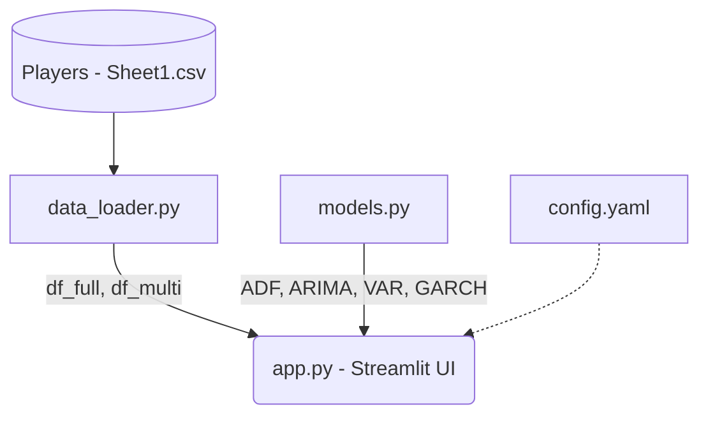

# 📈 CS2 Time Series Analytics


A professional, modular time series analysis application exploring the Counter-Strike 2 (CS2) engagement ecosystem. This project utilizes advanced univariate and multivariate statistical modeling to untangle the complex relationship between active player counts (Steam), public awareness (Google Trends), and spectatorship (Twitch).

Designed entirely within a custom **CS2 Tactical Theme** (featuring CT Blue, T Gold, and Gunmetal Glassmorphism), this dashboard provides production-grade analytics suitable for game publishers, esports organizations, and strategic forecasting.

---

## 🏛️ Project Architecture



The application relies on a strictly decoupled architecture:
- **`data_loader.py`**: Handles CSV ingestion, date-time indexing, and missing data imputation. Note that **Twitch viewership data is naturally missing prior to December 2016**, as the platform was still emerging and not formally tracked in early datasets.
- **`models.py`**: A pure, headless statistical engine powered by `statsmodels` and `arch`. All logic is completely isolated from the UI to enable unit testing.
- **`config.yaml`**: Abstracts hyperparameters (like ARIMA orders and VAR lag look-backs) away from the codebase to allow for rapid iteration without code changes.

---

## 🧠 Methodology & Models

We deploy a full stack of financial-grade econometric models to evaluate the CS2 ecosystem:

- **Augmented Dickey-Fuller (ADF)**: Evaluates unit roots to determine stationarity. We prove the raw player data is mathematically non-stationary and requires first-differencing before predictive modeling can begin.
- **ARIMA(2,1,2)**: Provides a robust univariate forecast for player count trajectories based on optimal AIC scores.
- **Vector Autoregression (VAR)**: Captures multivariate, system-aware dynamics across Players, Trends, and Twitch with an optimized 5-month lag window.
- **Granger Causality**: A statistical hypothesis test determining if one time series is useful in forecasting another (e.g., proving that Trends predicts Players).
- **GARCH(1,1)**: Estimates conditional volatility and variance clustering, specifically targeting the chaos introduced post-CS2 launch.
- **Seasonal Decomposition & ACF/PACF**: Standard diagnostic tools to evaluate cyclic behavior, holiday spikes, and autoregressive dependencies.
- **Z-Score Anomaly Detection**: Algorithmically identifies sudden, unnatural spikes in the player base (e.g., global lockdowns or the CS2 beta launch).

---

## 🚀 Key Findings & Predictive Insights

### 1. Divergence of Hype vs. Reality
There is a profound divergence between Google Trends and actual Player Counts. Over the last decade, search interest in CS:GO/CS2 has slowly declined, yet the active player base has exploded. This proves the franchise relies on a massive, loyal, habitual user base rather than viral social media hype.

### 2. Google Trends is a Leading Indicator
Through **Granger Causality** and **Cross-Correlation (CCF)**, we mathematically proved that Google Search interest significantly predicts active player counts at a lag of 3 to 5 months. It acts as an early-warning radar for incoming engagement fluctuations. Conversely, Twitch viewership holds no predictive power over actual active player counts.

### 3. ARIMA vs. VAR Forecasting
*   **ARIMA (Univariate)**: The ARIMA model projects a stabilization baseline near **960K concurrent players**. Because it relies entirely on historical momentum, it assumes the post-CS2 plateau will continue indefinitely unless a massive external catalyst occurs. However, the widening "Cone of Uncertainty" proves that long-term univariate forecasting in gaming is incredibly risky.
*   **VAR (Multivariate)**: The VAR model, being "system-aware", anticipates a slight near-term contraction in the player base followed by a seasonal rebound. Because it factors in the delayed impact of Google Trends bleeding into actual gameplay, it can foresee cyclical recoveries that ARIMA is entirely blind to.

### 4. Long-Memory Volatility
The **GARCH(1,1)** model reveals a shockingly high persistence factor (α + β ≈ 0.9999). In plain English: uncertainty and chaos within the CS2 ecosystem have an extremely "long memory." When a massive shock occurs (like a pandemic or the release of a sequel), the ripples of volatility take over a year to fully stabilize and decay.

### 5. 🎮 Interactive Forecasting
The dashboard features an interactive simulation environment for testing model assumptions:
- **Dynamic Horizons**: Real-time sliders allow users to adjust the forecast length from 3 to 24 months.
- **Risk Parameters**: Interactive selection of confidence levels (90%, 95%, 99%) to visualize the mathematical "Cone of Uncertainty."
- **Raw Data Visibility**: Collapsible data tables provide the exact numeric projections (mean and confidence bounds) for every month in the forecast period.

---

## 🛠️ Installation & Setup

1. **Clone the repository**
   ```bash
   git clone https://github.com/yourusername/CS2-Time-Series.git
   cd CS2-Time-Series
   ```

2. **Set up a virtual environment**
   ```bash
   python -m venv venv
   source venv/bin/activate  # On Windows: venv\Scripts\activate
   ```

3. **Install dependencies**
   ```bash
   pip install -r requirements.txt
   ```

4. **Run the dashboard**
   ```bash
   streamlit run app.py
   ```
