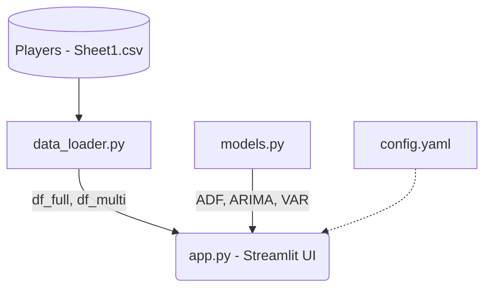

# 📈 CS2 Time Series Analytics


A professional, modular time series analysis application exploring the Counter-Strike 2 (CS2) engagement ecosystem. This project utilizes multivariate statistical modeling to understand the relationship between active player counts (Steam), public awareness (Google Trends), and spectatorship (Twitch).

## 🏛️ Project Architecture



## 🧠 Methodology & Models
- **Augmented Dickey-Fuller (ADF)**: Evaluates unit roots to determine stationarity.
- **ARIMA(2,1,2)**: Provides a robust univariate forecast for player count trajectories based on optimal AIC.
- **Vector Autoregression (VAR)**: Captures multivariate dynamics across Players, Trends, and Twitch with a 12-step forecast.
- **Granger Causality**: Determines if one time series is useful in forecasting another (e.g., Trends predicting Players).
- **GARCH(1,1)**: Estimates conditional volatility, specifically targeting variance clustering post-CS2 launch.
- **Seasonal Decomposition & ACF/PACF**: Standard diagnostic tools to evaluate cyclic behavior and autoregressive dependencies.

## 🚀 Key Findings
> **Google Trends as a Leading Indicator**  
> Granger Causality tests confirm that Google Search interest significantly predicts player counts at lags of 3-5 months, providing an early-warning signal for engagement changes.

> **Structural Independence of Spectatorship**  
> Despite massive spikes during major esports events, Twitch viewership holds no predictive power over actual active player counts.

> **Long-Memory Volatility**  
> The GARCH(1,1) model reveals a high persistence factor (α + β ≈ 1.0), meaning uncertainty shocks (like the CS2 transition) decay extremely slowly over 12-18 months.

## 🛠️ Installation & Setup

1. **Clone the repository**
   ```bash
   git clone https://github.com/yourusername/CS2-Time-Series.git
   cd CS2-Time-Series
   ```

2. **Set up a virtual environment**
   ```bash
   python -m venv venv
   source venv/bin/activate  # On Windows: venv\Scripts\activate
   ```

3. **Install dependencies**
   ```bash
   pip install -r requirements.txt
   ```

4. **Run the dashboard**
   ```bash
   streamlit run app.py
   ```
